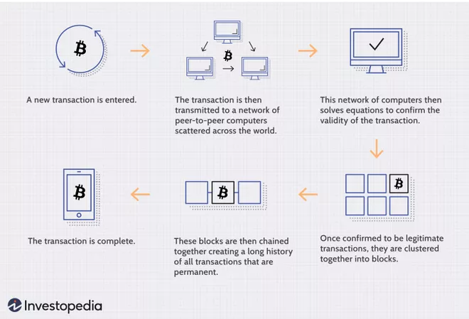
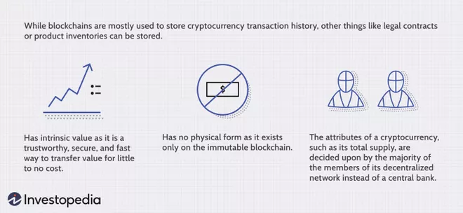

## What is a Blockchain?
- Distributed database or ledger that is shared among the nodes of a computer network
- Crutial role in cryptocurrency systems

- Type of shared database that differs froma a typical database in the way that it stores information
	- Blockchain stores data in blocks linked together by cryptography

- As new data comes in, it is entered into a fresh block
- Once the block is filled with data, it is chained onto the previous block, which makes the data chained together in chronological order

- Different types of data can be stored
- Most common use is a ledger for cryptocurrency transactions

- For Bitcoin, blockchain is used in a decentralized way so that no single person or group has control
- All users collectively retain control

- Decentralized blockchains are immutable
- Data entered is irreverssable
- Everything entered is permantently recorded and viewable to anyone

## How does Blockchain work?
- Goal is allow digital information be recorded and distributed, but NOT edited
- Also known as Distributed Ledger Technology (DLT)
- First proposed in 1991
- Bitcoin came out in 2009
- Since first proposal, we have seen blockchain in a number of use cases
	- Cryptocurrencies
	- Decentralized Finance (DeFi) applications
	- Non-fungible Tokens (NFTs)
	- Smart Contracts

### Transaction Process

### Attributes of Cryptocurrency

## Blockchain Decentralization
- 

Resources 

https://www.investopedia.com/terms/b/blockchain.asp