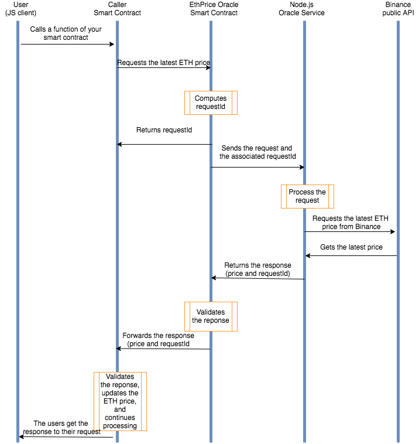

### Setting Things Up
- Suppose we want to build a DeFi app and want to give users the ability to withdraw ETH worth a certain amount of USD
- The smart contract must know how much one Ether is worth, compared to USD
- `JavaScript` can easily fetch this info, making a request to the Binance API as an example
	- However, smart contracts cannot do this
	- They cannot access data from the outside world
	- Relies on an **oracle** for this data

- Here's how it works as a diagram



Let's fire up some stuff

1. `npm init -y`
2. `npm i truffle openzeppelin-solidity loom-js loom-truffle-provider bn.js axios`
	- All of these packages will eventually get used

3. The oracle will livve in the `oracle` directory
```bash 
mkdir oracle && cd oracle && npx truffle init && cd ..
```

4.  The caller contract will live in the `caller` directory

```bash 
mkdir caller && cd caller && npx truffle init && cd ..
```

5. If everything went well, if you write the command

```bash
tree -L 2 -I node_modules
```

You should get something like

```
.
├── caller
│   ├── contracts
│   ├── migrations
│   ├── test
│   └── truffle-config.js
├── oracle
│   ├── contracts
│   ├── migrations
│   ├── test
│   └── truffle-config.js
└── package.json
```

### Calling Other Contracts
- One of the things that the caller smart contract does is to interact with the Oracle contract
- For the smart contract to interact with the oracle, you must provide it with the following
	- The address of the oracle smart contract
	- The signature of the function you want to call
- We need to write a function that saves the address of the oracle into a variable
- Then it will instantiate the contract so that the caller can call the oracle at any time

- In order for the caller contract to interact with the oracle, we must define an **interface**

### Review of interfaces
- Can only decalre functions
- Can't
		- Define state variables
		- Define Constructors
		- Inherit from other contracts
- Similar to ABIs (Application Binary Interaces)
	- That is, the ABI provides the function/methods that can be called to the JavaScript code
- Used to allow different contracts to interact with each other, all functions must be external


```solidity
pragma solidity 0.5.0;

contract CallerContract {
	address private oracleAddress;
	
	function setOracleInstanceAddress (address _oracleInstanceAddress) public {
		oracleAddress = _oracleInstanceAddress;
	}

}
```

