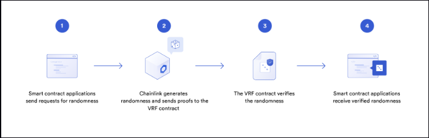

### Chainlink Data Feeds
- Suppose we are building a DeFi dapp and want to give users the ability to withdraw ETH worth a certain amout of USD
- To fulfill this request, the smartk contract must know how much one Ether is worth
- One way to do this
	- JavaSript application can fetch this information, make requests to the **Binance public API**
	- But a smart contract can't do this directly
- Another way
	- Build a JS application ourselves, but then we are introducing a centralized point of failure!
	- We also couldn't just pull from Binance because again, single point of failure!
- The right way
	- Use a decentralized oracle network (DON)
	- Decentralized data sources

### Chain Link
- Chainlink is a frame for DONs and is a way toget data in from multiple sources across multiple oracles
- This DON aggregates data in a decentralized manner and places it on the blockchain in a smart contract ("price reference feed" or "data feed") for us to read from
- All we have to do is read from a contract on the Chainlink network that is constantly being updated
	- News
	- Prices
- Using Chailink Data Feeds is a way to cheaply, more accurately, and with more security gather data from the real world in this decentralized context
- Since data is coming from multiple sources, multiple people can partake in the ecosystem and it becomes **even cheaper than running a centralized oracle**
- Uses **Off-chain Reporting** to reach consensus on data off-chain and report the data in a cryptographhically proven single transaction back on-chain for users to digest
- Can then make protocols like **Synthetix**, **Aave**, and **Compound**

https://data.chain.link/

### Importing from NPM and Github
- We can import code from right outside our contracts
- Often times, we don't need to have every piece of code directly in project
- Can borrow from other application!
- We can either user GitHub or NPM 

https://github.com/smartcontractkit/chainlink/blob/master/contracts/src/v0.6/interfaces/AggregatorV3Interface.sol

https://www.npmjs.com/package/@chainlink/contracts

### AggregatorV3Interface
- For example, we can use the on-chain **Feeds Registry** which is an on-chain contract that keeps track of where all of the data feeds are
	- https://docs.chain.link/docs/feed-registry/
- Or we can use a contract address directly to access the feed
	- https://docs.chain.link/docs/reference-contracts/

- Our example involves finding the price of ETH in terms of USD, so we need to find the data feed with this information
- **IMPORTANT:** Each network will have a different address for eatch piece of data we would use. The address of the `ETH/USD` contract will be different on Mainnet Ethereum from Mainnet Polygon, from Rinkby, etc.
- For this example, w will use the Rinkeby test network
	- https://docs.chain.link/docs/ethereum-addresses/#Rinkeby%20Testnet
- Here's how we would start the contract
```solidity
pragma solidity ^0.6.7;

  
import "@chainlink/contracts/src/v0.6/interfaces/AggregatorV3Interface.sol";

  
contract PriceConsumerV3 {

	AggregatorV3Interface public priceFeed;

	constructor() public {
		priceFeed = AggregatorV3Interface(0x8A753747A1Fa494EC906cE90E9f37563A8AF630e);
	}
}
```

### Working with Tuples
- Now we have to retrieve the latest ETH price by calling the `latestRoundData` function of the `priceFeed` contract
- This function has all the information we are looking for
	- `roundId`: The round ID. Each price update gets a unique round ID
	- `answer`: The current pricer
	- `startedAt`: Timestamp of when the round started
	- `updatedAt`: Timestamp of when the round was updated.
	- `answeredInRound`: The round ID of the round in which the answer was computed

#### Tuples
- A `tuple` is `solidity` is a way to create syntatic grouping of expression
- If a function returns multiple variables, such as the `latestRoundData`, we consider the return type to be a `tuple` of many types

```solidity
function latestRoundData() external view returns (
	uint80 roundId,
	int256 answer,
	uint256 startedAt,
	uint256 updatedAt, 
	uint80 answeredInRound
);
```

- to use this function, we must assign a variable to each of these return values. We can do these in multiple ways
	- Get all of the values back or get a particular value back
```solidity
// saving all return variables
(uint80 roundId, int price, uint startedAt, uint updatedAt, uint80 answeredInRound) = priceFeed.latestRoundData(); 

// saving only the price variable
(,int price,,,) = priceFeed.latestRoundData();
```

### Chainlink Data Feeds Decimals
- If we call the previous function to gather the price data for `ETH/USD`
	- Then we would get something like `310523971888`
	- This is supposedly a decimal...
	- At the time of writing this `ETH` is worth `$3,105.52`
- There is a function that can tell us where the decimal points are
- We can write this function
```solidity
// This function will tell us where the decimal places go from `priceFeed.latestRoundData()`
public getDecimals() public view returns (uint8){
	uint8 decimals = priceFeed.decimals();
	return decimals;
}
```


### Chainlink Data Feeds Reference
- Now we can get data from a DON into our created Smart Contract
- To follow along and deploy a Chainlink project, look at the following link
	- https://docs.chain.link/docs/conceptual-overview/
	- The above is also a great resource to refresh some solidity basics
- Often developers choose to work with some of these "out-of-the-box" oracle services since they are much easier and require almost no time to setup
- Once developers are familiar with Chainlink, we can use the following to build sophiosted smart contract application in development suites
	- <a href="https://github.com/smartcontractkit/truffle-starter-kit">Truffle Starter Kit</a>
	- <a href="https://github.com/smartcontractkit/hardhat-starter-kit">Hardhat Starter Kit</a>
	- <a href="https://github.com/smartcontractkit/chainlink-mix">Brownie Starter Kit</a>
- Until then, there are more features to learn about Chainlink
### Chainlink VPF Introduction
- Stands for Chainlink **V**erifiable **R**andomness **F**unction
- It is a way to get randomness from outside the blockchain, but in a proven cryptographic manner
- This is important because for random number generators, we want the logic to be truly incorruptable
- But why not just use a Chainlink data feed to grab a random number?
	- Remember these data are not fully reliable
		- If someone says they are feeding you truly random numbers
			- How do you know they are not lying?
			- If you're building a game, what's to stop them from putting a bias for his profile
			- This service could be hacked
			- You could end up with a corrupt number
- Chainlink VPF includes on-chain verification contracts that cryptogrraphically prove that the random number on the contract is truly random



### Basic Request Model
1. The first step is when a smart contract (called the "callee contract") makes a "request" to a Chainlink node whioch is comprised of 
	- Smart Contract
	- Corresponding Off-Chain Node
2. When the Chainlink node receives the request, the smart contract emits a specific event that the corresponding Chainlink node is subscribed to/looking for
	- This happens in one transaction
3. Chainlink oracle will then process the request and return the data/computation back to the callee contract, or a contract that will in turn send the response to the callee contract
	- The middle contract is often referred to as the *oracle contract*
	- This return process happens in a second **seperate** transaction so in total the basic request model is a two transaction event, and will take at least two blocks to complete
	- This is hard to hack because of the minimum number of transactions being two, allows for brute force attacks to be extremely expensive

- Now, similar to when we make a transaction on Ethereum or any Solidity compatible blockchain
	- Transaction gas is required
- To work with oracle
	- We need some oracle gas, also known as the <a href="https://chain.link/">Link or Chainlink token</a>
